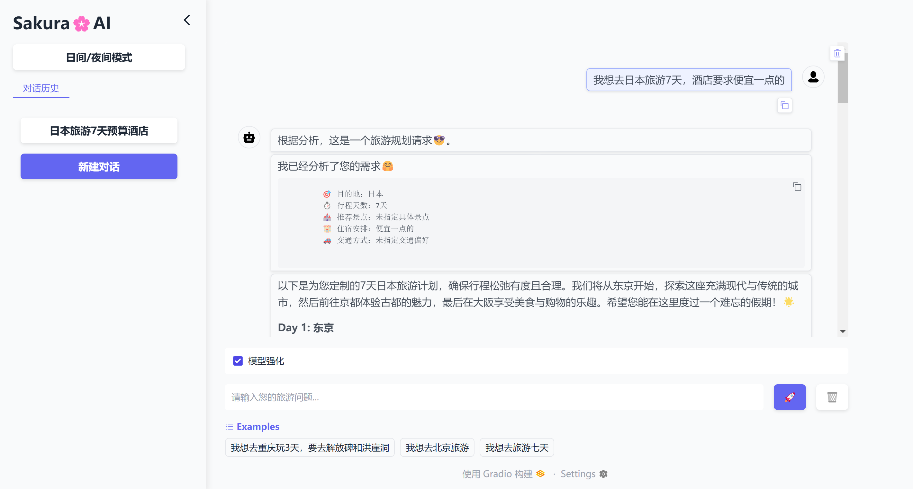

## **🌸SakuraAI🌸智能旅游助手🤗**

## **使用手册** 
### 环境安装
```bash
pip install -r requirements.txt
```
### 数据来源
- 数据采集使用[MediaCrawler](https://github.com/NanmiCoder/MediaCrawler "MediaCrawler")采集于小红书 
- 数据生成使用[DeepSeek](https://www.deepseek.com)的API
- 若需要使用数据生成的OCR功能，请访问[PaddlePaddle官网](https://www.paddlepaddle.org.cn/install/quick?docurl=/documentation/docs/zh/install/pip/windows-pip.html)下载库

```bash
# 根据cuda版本安装
python -m pip install paddlepaddle-gpu==2.6.2 -i https://www.paddlepaddle.org.cn/packages/stable/cu118/
```

> 数据仅供用于学习用途，禁止用于商业、非法用途。

### 下载Qwen2.5-7B-Instruct

```bash
sudo apt-get install git-lfs
git lfs install
git clone https://hf-mirror.com/Qwen/Qwen2.5-7B-Instruct
cd Qwen2.5-7B-Instruct
git lfs pull
```

### 启动Web


```bash
python3 web/app.py
```
